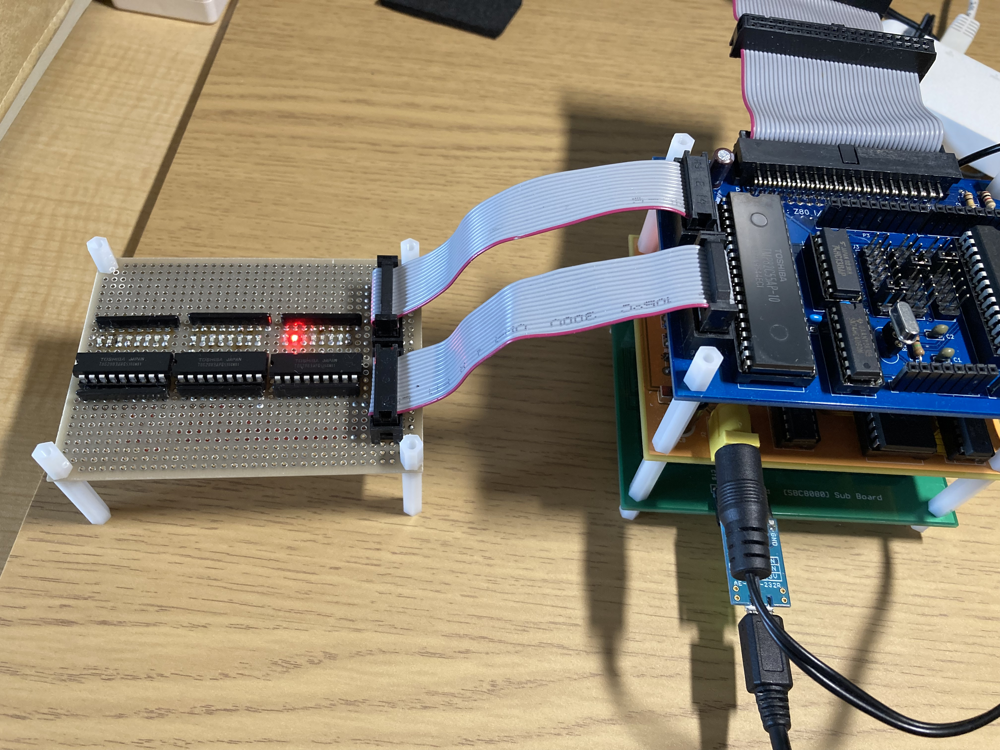
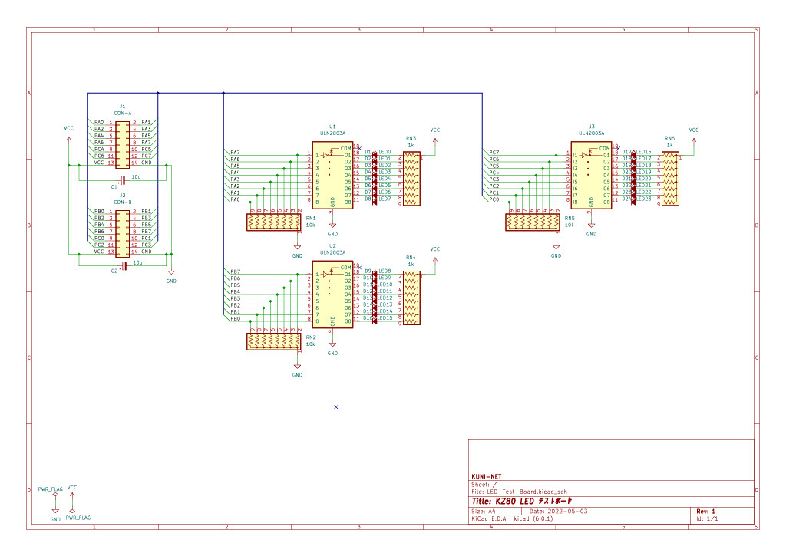

# KZ80-IOB LED Tedt Board

## 概要

* KZ80-IOBなどでLEDチカチカさせるためのテストボードです。
  * KZ80-IOB、K65-IOBなどのI/O端子(MIL 14Pコネクタ)へ接続して使用します。
* LED駆動のためにトランジスタアレイをつけてみました。
* ユニバーサル基板で試作する場合は、表面実装LEDで構成すると一列に並んできれいです。

## 回路図

## 参考URL
* KZ80-IOB(KZ80マイコン I/Oボード)
  * https://github.com/kuninet/Z80_IOB
  * https://kuninet.org/?cat=21

* K65-IOB (6502マイコンI/Oボード)
  * https://github.com/kuninet/Z80_IOB
  * 
